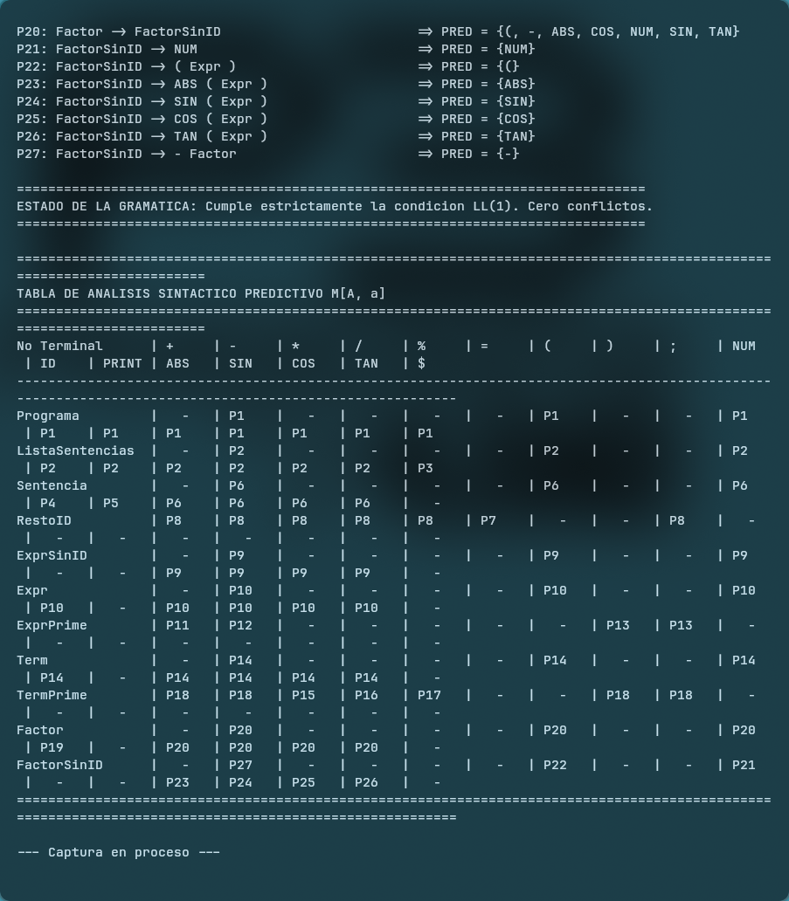
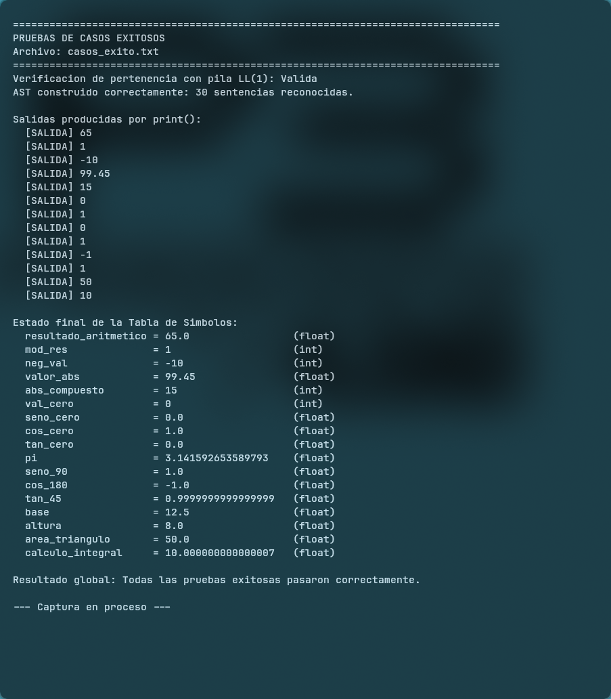
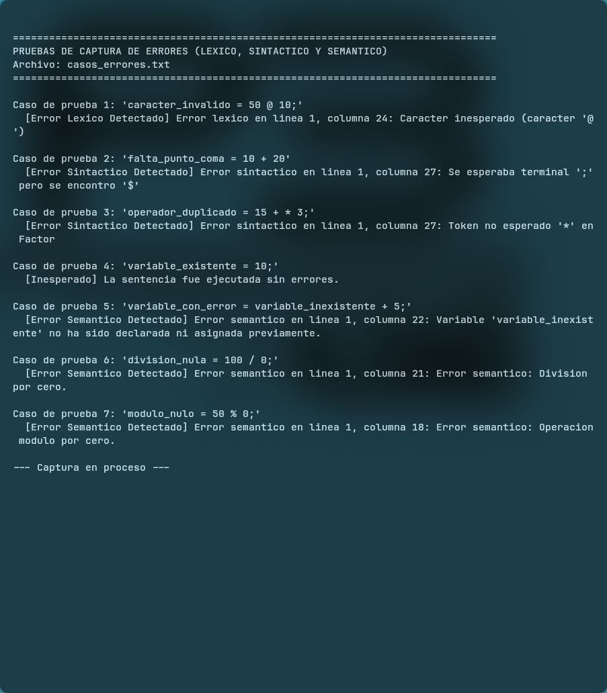
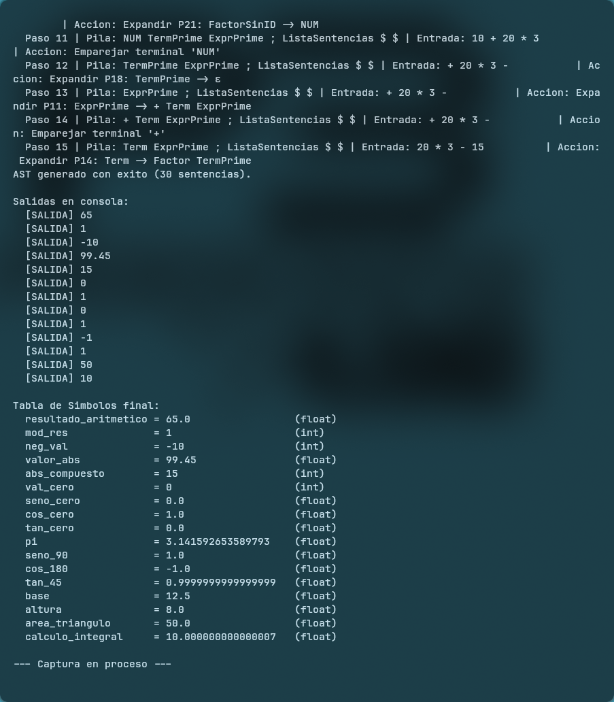

# Diseno e Implementacion de una Gramatica LL(1)

**Asignatura:** Lenguajes de Programacion y Traduccion  
**Integrantes:** Dylan Torres · Juan Gomez · Javier Rosero  
**Repositorio Remoto:** [infinitummm/gramatica-LL-1](https://github.com/infinitummm/gramatica-LL-1)  
**Entorno de Ejecucion:** Python 3  

---

## Introduccion

El analisis sintactico descendente predictivo constituye uno de los metodos fundamentales en la teoria de la construccion de compiladores. Dentro de esta familia de algoritmos, los analizadores LL(1) se caracterizan por procesar la entrada de izquierda a derecha (*Left-to-right*), construyendo una derivacion por la izquierda (*Leftmost derivation*) mediante la consulta de un unico componente lexico de anticipacion (*1 lookahead token*).

Para que una gramatica libre de contexto sea apta para el analisis LL(1), es condicion indispensable que no presente recursion izquierda y que se encuentre factorizada por la izquierda, garantizando que cada decision sintactica sea determinista y libre de ambiguedad.

En este proyecto se presenta el diseno formal y la implementacion completa de un compilador de tres fases (analisis lexico, sintactico predictivo por tabla y semantico con tabla de simbolos) para un lenguaje de programacion que soporta:

- Operaciones aritmeticas con jerarquia clasica de operadores: adicion (`+`), sustraccion (`-`), multiplicacion (`*`), division (`/`) y residuo modular (`%`).
- Operacion unaria de cambio de signo (`-`) y agrupamiento prioritario mediante parentesis.
- Funcion de valor absoluto (`abs`).
- Funciones trigonometricas fundamentales: seno (`sin`), coseno (`cos`) y tangente (`tan`).
- Asignacion dinamica de variables y consulta de identificadores.
- Sentencia de impresion y despliegue de resultados (`print`).

---

## Especificacion Formal de la Gramatica LL(1)

La gramatica ha sido disenada para resolver de manera simultanea la precedencia de operadores, la asociatividad hacia la izquierda y la coexistencia de sentencias de asignacion y evaluacion sin incurrir en conflictos de anticipacion.

### Simbolos No Terminales y Terminales

- **Simbolo Inicial:** `Programa`
- **Conjunto de No Terminales ($V_N$):** `Programa`, `ListaSentencias`, `Sentencia`, `RestoID`, `ExprSinID`, `Expr`, `ExprSol`, `Term`, `TermSol`, `Factor`, `FactorSinID`.
- **Conjunto de Terminales ($\Sigma$):** `+`, `-`, `*`, `/`, `%`, `=`, `(`, `)`, `;`, `NUM`, `ID`, `PRINT`, `ABS`, `SIN`, `COS`, `TAN`, `SQRT`, `$`.

### Reglas de Produccion

```text
P1:  Programa            -> ListaSentencias $
P2:  ListaSentencias     -> Sentencia ListaSentencias
P3:  ListaSentencias     -> ε
P4:  Sentencia           -> ID RestoID ;
P5:  Sentencia           -> PRINT ( Expr ) ;
P6:  Sentencia           -> ExprSinID ;
P7:  RestoID             -> = Expr
P8:  RestoID             -> TermSol ExprSol
P9:  ExprSinID           -> FactorSinID TermSol ExprSol
P10: Expr                -> Term ExprSol
P11: ExprSol             -> + Term ExprSol
P12: ExprSol             -> - Term ExprSol
P13: ExprSol             -> ε
P14: Term                -> Factor TermSol
P15: TermSol             -> * Factor TermSol
P16: TermSol             -> / Factor TermSol
P17: TermSol             -> % Factor TermSol
P18: TermSol             -> ε
P19: Factor              -> ID
P20: Factor              -> FactorSinID
P21: FactorSinID         -> NUM
P22: FactorSinID         -> ( Expr )
P23: FactorSinID         -> ABS ( Expr )
P24: FactorSinID         -> SIN ( Expr )
P25: FactorSinID         -> COS ( Expr )
P26: FactorSinID         -> TAN ( Expr )
P27: FactorSinID         -> SQRT ( Expr )
P28: FactorSinID         -> - Factor
```

### Justificacion del Diseno Sintactico

- **Eliminacion de Recursion Izquierda:** La adicion y la sustraccion se modelan mediante `Expr` y `ExprSol` (solucion/continuacion de expresion), mientras que el producto, la division y el modulo se gestionan con `Term` y `TermSol` (solucion/continuacion de termino). Esta factorizacion emula la asociatividad hacia la izquierda sin generar ciclos recursivos por la izquierda.
- **Factorizacion del Identificador:** Tanto la asignacion de variables como las expresiones que inician con un identificador comparten el prefijo `ID`. El no terminal auxiliar `RestoID` permite posponer la decision hasta observar el siguiente token (`=` para asignacion frente a `*`, `/`, `%`, `+`, `-`, `;` para expresiones), resolviendo el conflicto con exactamente un token de anticipacion.
- **Aislamiento de Factores sin Identificador:** El no terminal `ExprSinID` permite aceptar evaluaciones directas que inician con numeros, parentesis o funciones matematicas, garantizando que los conjuntos de prediccion de las tres alternativas de `Sentencia` sean disjuntos.

---

## Fundamentos Matematicos y Calculo de Conjuntos

El compilador incorpora un motor matematico que calcula de manera automatica los conjuntos mediante algoritmos de punto fijo iterativo.

### Conjuntos PRIMEROS (FIRST)

Indican el conjunto de terminales que pueden aparecer al inicio de una cadena derivada de cada no terminal:

| No Terminal | Conjunto PRIMEROS |
| :--- | :--- |
| `Programa` | `{$, (, -, ABS, COS, ID, NUM, PRINT, SIN, SQRT, TAN}` |
| `ListaSentencias` | `{(, -, ABS, COS, ID, NUM, PRINT, SIN, SQRT, TAN, ε}` |
| `Sentencia` | `{(, -, ABS, COS, ID, NUM, PRINT, SIN, SQRT, TAN}` |
| `RestoID` | `{%, *, +, -, /, =, ε}` |
| `ExprSinID` | `{(, -, ABS, COS, NUM, SIN, SQRT, TAN}` |
| `Expr` | `{(, -, ABS, COS, ID, NUM, SIN, SQRT, TAN}` |
| `ExprSol` | `{+, -, ε}` |
| `Term` | `{(, -, ABS, COS, ID, NUM, SIN, SQRT, TAN}` |
| `TermSol` | `{%, *, /, ε}` |
| `Factor` | `{(, -, ABS, COS, ID, NUM, SIN, SQRT, TAN}` |
| `FactorSinID` | `{(, -, ABS, COS, NUM, SIN, SQRT, TAN}` |

### Conjuntos SIGUIENTES (FOLLOW)

Contienen los terminales que pueden figurar inmediatamente a la derecha de cada no terminal en alguna forma sentencial valida. El simbolo `$` denota el marcador de fin de archivo:

| No Terminal | Conjunto SIGUIENTES |
| :--- | :--- |
| `Programa` | `{$}` |
| `ListaSentencias` | `{$}` |
| `Sentencia` | `{$, (, -, ABS, COS, ID, NUM, PRINT, SIN, SQRT, TAN}` |
| `RestoID` | `{;}` |
| `ExprSinID` | `{;}` |
| `Expr` | `{), ;}` |
| `ExprSol` | `{), ;}` |
| `Term` | `{), +, -, ;}` |
| `TermSol` | `{), +, -, ;}` |
| `Factor` | `{%, ), *, +, -, /, ;}` |
| `FactorSinID` | `{%, ), *, +, -, /, ;}` |

### Conjuntos de PREDICCION (PRED)

Para cada produccion $A \to \alpha$, el conjunto de prediccion orienta la seleccion de la regla en tiempo constante:

- Si $\alpha$ no deriva en la cadena vacia, $\text{PRED}(A \to \alpha) = \text{PRIMEROS}(\alpha)$.
- Si $\alpha$ es anulable ($\epsilon \in \text{PRIMEROS}(\alpha)$), $\text{PRED}(A \to \alpha) = (\text{PRIMEROS}(\alpha) - \{\epsilon\}) \cup \text{SIGUIENTES}(A)$.

| Produccion | Conjunto de PREDICCION |
| :--- | :--- |
| `P1: Programa -> ListaSentencias $` | `{$, (, -, ABS, COS, ID, NUM, PRINT, SIN, SQRT, TAN}` |
| `P2: ListaSentencias -> Sentencia ListaSentencias` | `{(, -, ABS, COS, ID, NUM, PRINT, SIN, SQRT, TAN}` |
| `P3: ListaSentencias -> ε` | `{$}` |
| `P4: Sentencia -> ID RestoID ;` | `{ID}` |
| `P5: Sentencia -> PRINT ( Expr ) ;` | `{PRINT}` |
| `P6: Sentencia -> ExprSinID ;` | `{(, -, ABS, COS, NUM, SIN, SQRT, TAN}` |
| `P7: RestoID -> = Expr` | `{=}` |
| `P8: RestoID -> TermSol ExprSol` | `{%, *, +, -, /, ;}` |
| `P9: ExprSinID -> FactorSinID TermSol ExprSol` | `{(, -, ABS, COS, NUM, SIN, SQRT, TAN}` |
| `P10: Expr -> Term ExprSol` | `{(, -, ABS, COS, ID, NUM, SIN, SQRT, TAN}` |
| `P11: ExprSol -> + Term ExprSol` | `{+}` |
| `P12: ExprSol -> - Term ExprSol` | `{-}` |
| `P13: ExprSol -> ε` | `{), ;}` |
| `P14: Term -> Factor TermSol` | `{(, -, ABS, COS, ID, NUM, SIN, SQRT, TAN}` |
| `P15: TermSol -> * Factor TermSol` | `{*}` |
| `P16: TermSol -> / Factor TermSol` | `{/}` |
| `P17: TermSol -> % Factor TermSol` | `{%}` |
| `P18: TermSol -> ε` | `{), +, -, ;}` |
| `P19: Factor -> ID` | `{ID}` |
| `P20: Factor -> FactorSinID` | `{(, -, ABS, COS, NUM, SIN, SQRT, TAN}` |
| `P21: FactorSinID -> NUM` | `{NUM}` |
| `P22: FactorSinID -> ( Expr )` | `{(}` |
| `P23: FactorSinID -> ABS ( Expr )` | `{ABS}` |
| `P24: FactorSinID -> SIN ( Expr )` | `{SIN}` |
| `P25: FactorSinID -> COS ( Expr )` | `{COS}` |
| `P26: FactorSinID -> TAN ( Expr )` | `{TAN}` |
| `P27: FactorSinID -> SQRT ( Expr )` | `{SQRT}` |
| `P28: FactorSinID -> - Factor` | `{-}` |

**Comprobacion LL(1):** Para cada simbolo no terminal, la interseccion de los conjuntos de prediccion entre cualesquiera dos alternativas es estrictamente vacia ($\text{PRED}(A \to \alpha_i) \cap \text{PRED}(A \to \alpha_j) = \emptyset$). La gramatica es estrictamente LL(1) y carece de conflictos.

---

## Tabla de Analisis Sintactico Predictivo M[A, a]

La matriz bidimensional $M[A, a]$ asocia cada par (no terminal, token) con a lo sumo una produccion. Las celdas con guion representan errores sintacticos inmediatos:

| No Terminal | `+` | `-` | `*` | `/` | `%` | `=` | `(` | `)` | `;` | `NUM` | `ID` | `PRINT` | `ABS` | `SIN` | `COS` | `TAN` | `SQRT` | `$` |
| :--- | :---: | :---: | :---: | :---: | :---: | :---: | :---: | :---: | :---: | :---: | :---: | :---: | :---: | :---: | :---: | :---: | :---: | :---: |
| `Programa` | - | P1 | - | - | - | - | P1 | - | - | P1 | P1 | P1 | P1 | P1 | P1 | P1 | P1 | P1 |
| `ListaSentencias` | - | P2 | - | - | - | - | P2 | - | - | P2 | P2 | P2 | P2 | P2 | P2 | P2 | P2 | P3 |
| `Sentencia` | - | P6 | - | - | - | - | P6 | - | - | P6 | P4 | P5 | P6 | P6 | P6 | P6 | P6 | - |
| `RestoID` | P8 | P8 | P8 | P8 | P8 | P7 | - | - | P8 | - | - | - | - | - | - | - | - | - |
| `ExprSinID` | - | P9 | - | - | - | - | P9 | - | - | P9 | - | - | P9 | P9 | P9 | P9 | P9 | - |
| `Expr` | - | P10 | - | - | - | - | P10 | - | - | P10 | P10 | - | P10 | P10 | P10 | P10 | P10 | - |
| `ExprSol` | P11 | P12 | - | - | - | - | - | P13 | P13 | - | - | - | - | - | - | - | - | - |
| `Term` | - | P14 | - | - | - | - | P14 | - | - | P14 | P14 | - | P14 | P14 | P14 | P14 | P14 | - |
| `TermSol` | P18 | P18 | P15 | P16 | P17 | - | - | P18 | P18 | - | - | - | - | - | - | - | - | - |
| `Factor` | - | P20 | - | - | - | - | P20 | - | - | P20 | P19 | - | P20 | P20 | P20 | P20 | P20 | - |
| `FactorSinID` | - | P28 | - | - | - | - | P22 | - | - | P21 | - | - | P23 | P24 | P25 | P26 | P27 | - |

---

## Arquitectura de las Fases del Compilador

El sistema se compone de tres etapas modulares acopladas linealmente:

### Analizador Lexico (`lexico/`)

Recibe la secuencia de caracteres fuente y genera el flujo de componentes lexicos (`Token`). Reporta errores con coordenadas exactas de linea y columna ante cualquier simbolo no reconocido, omitiendo comentarios y espacios en blanco.

### Analizador Sintactico (`sintactico/`)

Contiene el motor de prediccion que verifica formalmente la pertenencia mediante una pila de simbolos confrontada con la tabla $M[A, a]$. Al mismo tiempo, construye el Arbol de Sintaxis Abstracta (AST) y aplica el metodo de recuperacion en modo panico usando los conjuntos `SIGUIENTES` para continuar el analisis tras detectar discrepancias.

### Analizador Semantico (`semantico/`)

Gestiona la `TablaSimbolos`, comprobando que las variables hayan sido asignadas antes de su lectura. Evalua las expresiones matematicas correspondientes a funciones trigonometricas, valor absoluto y operadores aritmeticos, detectando anomalías semanticas en tiempo de ejecucion tales como divisiones o residuos por cero e indeterminaciones asintoticas.

---

## Evidencias de Pruebas y Resultados

A continuacion se presentan los registros visuales obtenidos durante la verificacion formal y practica de los modulos del compilador:

### Conjuntos LL(1) y Tabla Predictiva M[A, a]



### Bateria de Pruebas Exitosas

Demostracion del procesamiento de expresiones aritmeticas, funciones trigonometricas, calculo de valor absoluto, operaciones de residuo y persistencia en la tabla de simbolos:



### Manejo y Deteccion de Errores

Demostracion de captura controlada de anomalias en la fase lexica (caracter `@`), sintactica (ausencia de punto y coma, yuxtaposicion de operadores) y semantica (variable indefinida, division entre cero, modulo entre cero):



### Traza de Derivacion Sintactica en Pila

Detalle de los estados sucesivos de la pila de simbolos, el flujo de entrada y la aplicacion determinista de las reglas de produccion:



---

## Estructura del Repositorio

```text
gramatica LL(1)/
├── Makefile                            # Automatizador maestro de compilacion y pruebas
├── main.py                             # Punto de entrada principal con interfaz CLI
├── Como Runear.txt                     # Instrucciones directas de ejecucion
├── README.md                           # Documentacion tecnica unificada
│
├── lexico/
│   ├── __init__.py
│   ├── definicion_tokens.py            # Enumeracion de TipoToken y dataclass Token
│   └── analizador_lexico.py            # Scanner con manejo de posiciones y palabras clave
│
├── sintactico/
│   ├── __init__.py
│   ├── gramatica_ll1.py                # Definicion formal de la gramatica y reglas P1 a P27
│   ├── calculador_conjuntos.py         # Algoritmos de punto fijo para PRIMEROS, SIGUIENTES y PRED
│   ├── tabla_ll1.py                    # Construccion de la tabla M[A, a]
│   ├── arbol_sintactico.py             # Nodos del Arbol de Sintaxis Abstracta (AST)
│   └── analizador_sintactico_ll1.py    # Motor de pila LL(1) y recuperacion en modo panico
│
├── semantico/
│   ├── __init__.py
│   ├── tabla_simbolos.py               # Almacenamiento y validacion de variables
│   └── evaluador_semantico.py          # Chequeo semantico, calculo trigonometrico y ejecucion
│
├── pruebas/
│   ├── casos_exito.txt                 # Bateria de codigo fuente con casos validos
│   ├── casos_errores.txt               # Casos de prueba disenados para provocar errores
│   └── ejecutor_pruebas.py             # Script automatizado de pruebas integrales
│
└── capturas/                           # Registro grafico de las pruebas del compilador
    ├── 01_conjuntos_y_tabla_ll1.png
    ├── 02_pruebas_exitosas.png
    ├── 03_pruebas_errores.png
    └── 04_trazas_derivacion.png
```

---

## Instrucciones de Compilacion y Ejecucion

### Automatizacion Mediante Makefile

Desde el directorio del proyecto se encuentran habilitados los siguientes comandos:

- Desplegar los conjuntos formales, la tabla de analisis y ejecutar las pruebas:
  ```bash
  make
  ```

- Visualizar exclusivamente los conjuntos PRIMEROS, SIGUIENTES, PREDICCION y la matriz M[A, a]:
  ```bash
  make conjuntos
  ```

- Correr las baterias completas de prueba (casos validos y captura de errores):
  ```bash
  make test
  ```

- Visualizar el Arbol de Sintaxis Abstracta (AST) de casos de exito y de fracaso:
  ```bash
  make arbol
  ```

- Iniciar la consola interactiva en tiempo real (REPL):
  ```bash
  make interactivo
  ```

- Limpiar archivos temporales y caches de Python:
  ```bash
  make clean
  ```

### Ejecucion Directa con Python

Es posible invocar el script principal indicando la modalidad deseada:

- Calculo y visualizacion de conjuntos:
  ```bash
  python3 main.py --conjuntos
  ```

- Ejecucion de la suite de pruebas:
  ```bash
  python3 main.py --pruebas
  ```

- Visualizacion de arboles AST:
  ```bash
  python3 main.py --arbol
  ```

- Sesion interactiva:
  ```bash
  python3 main.py --interactivo
  ```

- Compilacion de un archivo de codigo fuente con traza de derivacion:
  ```bash
  python3 main.py pruebas/casos_exito.txt --trazas
  ```
